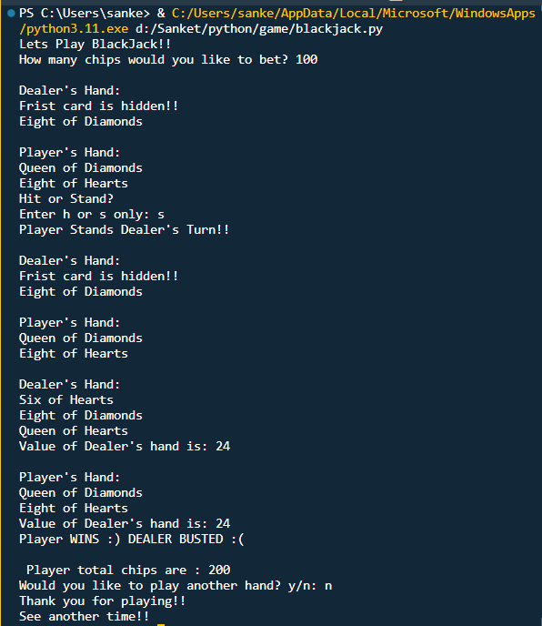

# Blackjack Game

## Overview
This Python-based Blackjack game project showcases the power of Object-Oriented Programming (OOP), essential library usage, and efficient data management using dictionaries. It's an interactive console-based game that simulates the classic casino experience.

## Features
- **Object-Oriented Design:** The game employs OOP principles to create a modular and maintainable structure. It uses classes for cards, decks, hands, and chips, making the codebase organized and extensible.
- **Library Integration:** Python's built-in `random` library is used to shuffle the deck, ensuring random card distribution, adding a realistic touch to the game.
- **Data Management with Dictionaries:** A comprehensive dictionary-based system is implemented to manage player data efficiently. It tracks chip counts, bets, and game results.
- **Deck Creation:** The game constructs a standard deck of 52 cards through OOP, ensuring scalability for future expansion.
- **Betting System:** Players can place bets, adhering to real gambling norms. The system ensures responsible gaming by validating that bets don't exceed available chips.
- **Card Distribution:** Two cards are dealt to both the Player and the Dealer, with elegant OOP modeling for cards and hands.
- **Partial Card Reveal:** The Dealer follows standard Blackjack rules by revealing one card while keeping the other hidden.
- **Interactive Gameplay:** Players can choose to Hit (take another card) or Stand (keep the current hand). The game actively prevents Busts (going over 21) and provides prompt decisions.
- **Dealer Logic:** The Dealer's actions are automated to reach or exceed a hand value of 17, following typical casino protocols.
- **Result Calculation:** The game determines the winner, adjusts the Player's chips based on the outcome, and uses dictionaries for efficient data management.
- **Replay Option:** After each game, players have the choice to play again, enhancing engagement.

## Usage
1. Run the Python script to start the game.
2. Follow the prompts to place bets, make decisions, and enjoy the thrill of Blackjack.

## Requirements
- Python 3.x

## How to Play
1. Run the script using `python blackjack.py`.
2. Enter the number of chips you'd like to bet when prompted.
3. Follow the on-screen instructions to Hit or Stand.
4. Enjoy the game and aim to beat the dealer!

## Sample Gameplay

## Disclaimer
This project is intended for educational and entertainment purposes only. It does not involve real money gambling.

